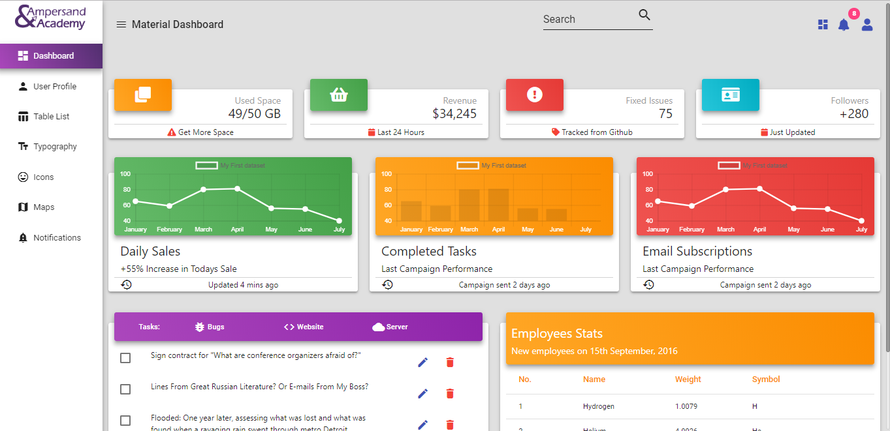

# angular-material-6-theme
Angular Material 6 Free theme. 

This theme is developed using the Angular 6 and Material 6 at Ampersand Academy. 

# Install Locally

Step1: Please download this repo

Step2: Execute the below command.


```
cd angular-material-6-theme
npm install
```

Step3: In app.module.ts file, replace YOUR_GOOGLE_MAP_API_KEY with actual google map api key.

Step4: Run 
```
ng serve --open
```

# Demo
https://ampersandacademy.com/angular-material-6-theme/

# Preview


